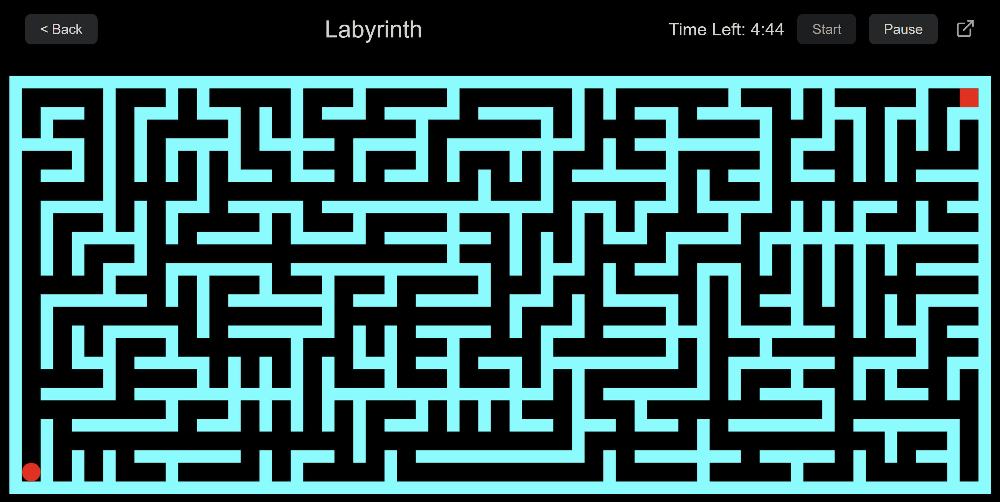

Labyrinth
 
A dynamic and responsive maze game built with HTML, CSS, and JavaScript. Navigate through endless, procedurally generated mazes with multiple game modes and difficulty levels.
 

Features 
Multiple Game Modes: 
Classic: Solve a single maze within the time limit. 
Endless: Solve as many mazes as you can before time runs out. 
Darkness: Navigate the maze with only a small circle of light around you.

Three Difficulty Levels: 
Easy: A spacious maze with a 5-minute timer. 
Medium: A balanced challenge with a 10-minute timer. 
Hard: A dense, complex maze with a 15-minute timer.

Responsive Design: The UI and maze scale perfectly to fit any screen, from desktops to mobile phones. 
Dual Control Schemes: Play with a keyboard on desktop or use on-screen buttons and swipe controls on touch devices.

How to Play 
Since this project is not hosted online, you can run it locally on your machine. 
Clone the repository 
Navigate to the directory 
Open the game: Simply open the index.html file in your favorite web browser.

Controls 
Desktop: Use the Arrow Keys to move. 
Mobile: Use the on-screen directional buttons or swipe in the direction you want to move.