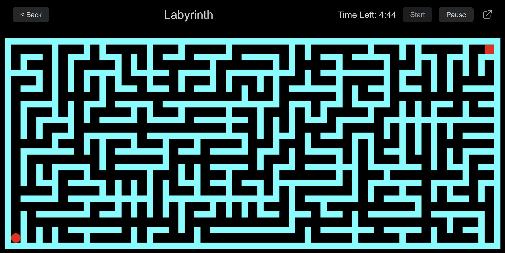

<h1>Labyrinth</h1>
 

A dynamic and responsive maze game built with HTML, CSS, and JavaScript. Navigate through endless, procedurally generated mazes with multiple game modes and difficulty levels.

 

  

  

<h2>Features</h2>
<h3>Game Modes:</h3>
<ul>
  <li><strong>Classic:</strong> Solve a single maze within the time limit.</li>
  <li><strong>Endless:</strong> Solve as many mazes as you can before time runs out.</li>
  <li><strong>Darkness:</strong> Navigate the maze with only a small circle of light around you.</li>
</ul>
<h3>Difficulty Levels:</h3>
<ul>
  <li><strong>Easy:</strong> A spacious maze with a 5-minute timer.</li>
  <li><strong>Medium:</strong> A balanced challenge with a 10-minute timer.</li>
  <li><strong>Hard:</strong> A dense, complex maze with a 15-minute timer.</li>
</ul>
<h3>Controls:</h3>
<ul>
  <li><strong>Desktop:</strong> Use the Arrow Keys to move.</li>
  <li><strong>Mobile:</strong> Use the on-screen directional buttons or swipe in the direction you want to move.</li>
</ul>